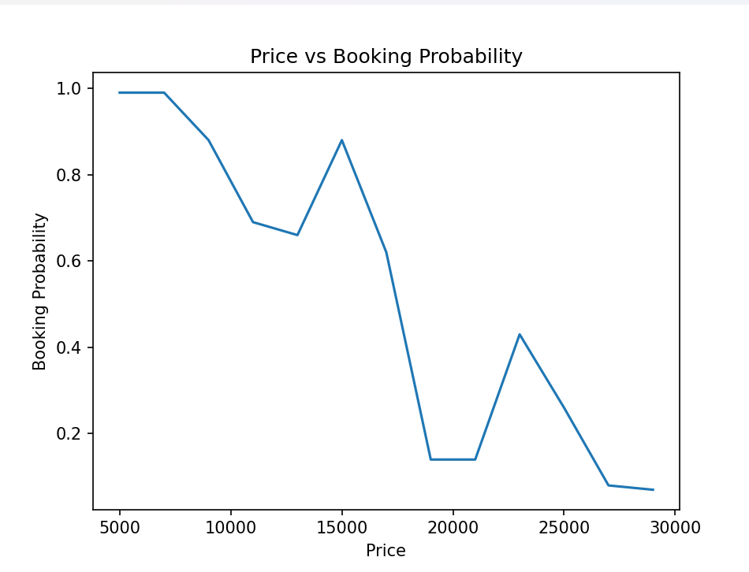
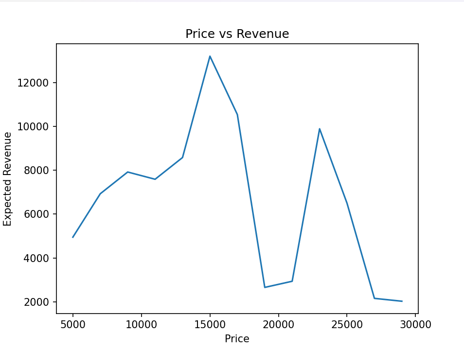

# Dynamic Pricing & Revenue Optimization Engine

## 📌 Overview
This project builds a data-driven dynamic pricing system to optimize revenue in a travel booking platform. It combines machine learning, simulation, and business constraints to make pricing decisions at an individual user level.

---

## 🎯 Problem Statement
Travel platforms face a key trade-off:

- Higher prices → Higher margin but lower conversion  
- Lower prices → Higher conversion but lower revenue  

This project solves the problem by determining the optimal price for each user to maximize expected revenue while maintaining realistic booking probabilities.

---

## ⚙️ Approach

### 1. Data Simulation
Generated user-level data including:
- User journey (search → view → plan)
- Budget and group size
- Trip timing and pricing

---

### 2. Machine Learning Model
- Trained a Random Forest model to predict booking probability
- Compared with Logistic Regression to evaluate performance
- Identified key drivers such as price and planning stage

---

### 3. Dynamic Pricing Engine
For each user:
- Simulated multiple price points
- Predicted booking probability for each price
- Calculated expected revenue:

> Revenue = Probability × Price

- Selected optimal price maximizing revenue

---

### 4. Constraint-Based Optimization
- Introduced a minimum probability threshold
- Ensured realistic and user-friendly pricing decisions

---

### 5. A/B Testing Simulation
Compared:
- Static pricing (baseline)
- Dynamic pricing (model-based)

---

### 6. Threshold Tuning
Tested different probability thresholds (0.2, 0.3, 0.4) to analyze trade-offs between aggressive and conservative pricing strategies.

---

### 7. Segment Analysis
Analyzed optimized revenue across:
- Budget segments
- Group size

---

## 📊 Key Results

- Achieved ~70%+ improvement in revenue using dynamic pricing
- Demonstrated trade-off between price and conversion
- Identified high-performing user segments

---

## 📈 Visual Insights

### Price vs Booking Probability

### Price vs Revenue

These plots highlight the trade-off between pricing and conversion, and show that optimal revenue occurs at intermediate price points.

---

## 🛠️ Tech Stack

- Python  
- Pandas  
- Scikit-learn  
- Matplotlib  

---

## 💡 Key Learnings

- Machine learning can be used for decision-making, not just prediction  
- Pricing is a trade-off between conversion and revenue  
- A/B testing is critical to validate business impact  

---

## 🚀 Conclusion

This project demonstrates how machine learning, combined with business constraints and simulation, can be used to build a real-world dynamic pricing system that improves revenue while maintaining user experience.